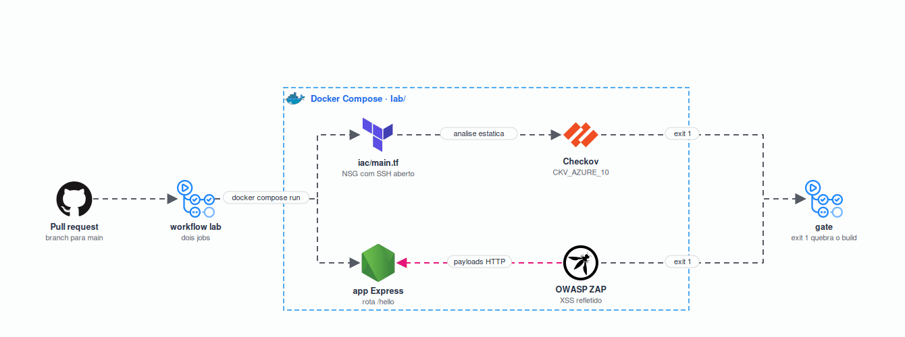

<h1 align="center">Check Point 01: Pipeline DevSecOps</h1>

<p align="center">
  Laboratório de IaC Security e DAST com gate de severidade no pipeline
</p>

<p align="center"></p>

<p align="center">
  <a href="https://skillicons.dev"></a>
</p>

## Sobre

Grupo 1 da disciplina Cloud Security: Automation e DevSecOps, da graduação em Cloud Computing da FIAP.

O trabalho cobre quatro frentes de teste automatizado no pipeline: SAST com Semgrep, SCA com OWASP Dependency-Check, IaC Security com Checkov e DAST com OWASP ZAP. O laboratório conduzido para a turma aplica duas delas, de categorias diferentes: **Checkov** e **OWASP ZAP**.

## O laboratório

Duas vulnerabilidades reais, uma em cada categoria. Em ambas o ciclo é o mesmo: rodar o scan, ver o gate quebrar o build, corrigir uma linha, rodar de novo.

| Categoria | Ferramenta | Vulnerabilidade | Identificador |
| --- | --- | --- | --- |
| IaC Security | Checkov | NSG com SSH liberado para a internet | `CKV_AZURE_10` |
| DAST | OWASP ZAP | XSS refletido na rota `/hello` | CWE-79 |

O roteiro completo está em [LAB.md](LAB.md).

## Como executar

```bash
git clone https://github.com/org-cloud-security/cp01-devsecops.fiap.git
cd cp01-devsecops.fiap/lab
docker compose run --rm checkov
docker compose up -d app && docker compose run --rm zap
```

Os dois comandos encerram com exit code 1 no estado vulnerável.

## O gate

O Checkov reprova por exit code: qualquer política violada devolve 1. A classificação por severidade não está disponível na versão open source, ela exige chave da plataforma Prisma Cloud.

O ZAP usa o job `exitStatus` do Automation Framework, que avalia a severidade real do alerta:

```yaml
- type: exitStatus
  parameters:
    errorLevel: High
```

O `zap-baseline.py` e o `zap-full-scan.py` classificam toda regra como WARN e encerram com exit code 2 independentemente da severidade. O plano de automação foi adotado justamente para que o build quebre em High, como pede o enunciado.

## Estrutura

| Caminho | Conteúdo |
| --- | --- |
| [LAB.md](LAB.md) | Roteiro do laboratório em cinco fases |
| [lab/](lab/) | Ambiente reprodutível: compose, Terraform, aplicação e plano do ZAP |
| [lab/reports/](lab/reports/) | Relatórios versionados do Checkov e do ZAP |
| [docs/achados/](docs/achados/) | Análise dos achados com veredito, CWE e correção |
| [docs/plano-b/](docs/plano-b/) | Gravação da execução completa |
| [.github/workflows/lab.yml](.github/workflows/lab.yml) | Pipeline com os dois gates |

## Integrantes

| Nome | RM |
| --- | --- |
| Luiz Brito | 562192 |
| Bruno Henrique | 566277 |
| Anderson Huang | 565920 |
| Guylherme Miguel | 562374 |
